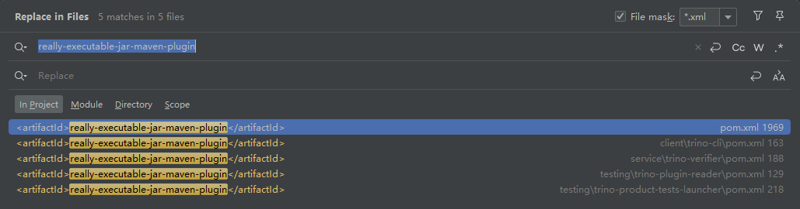
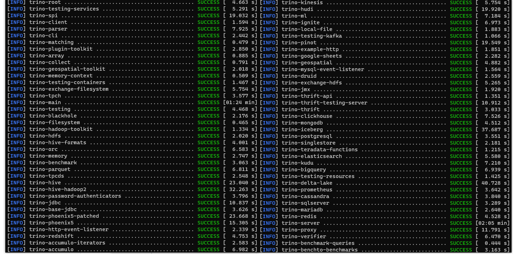
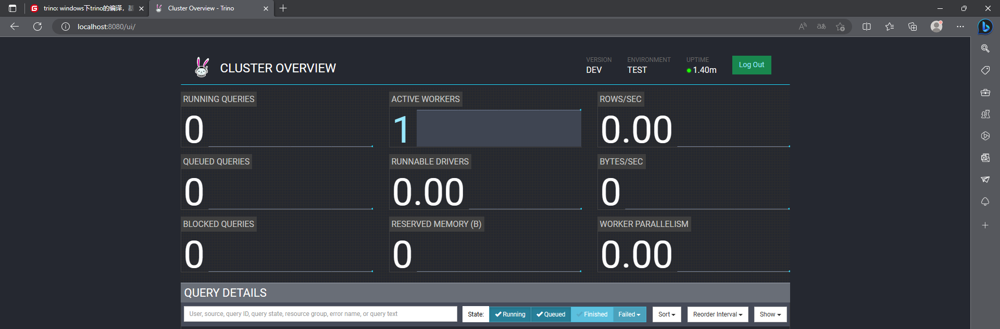
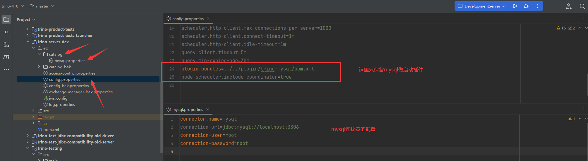
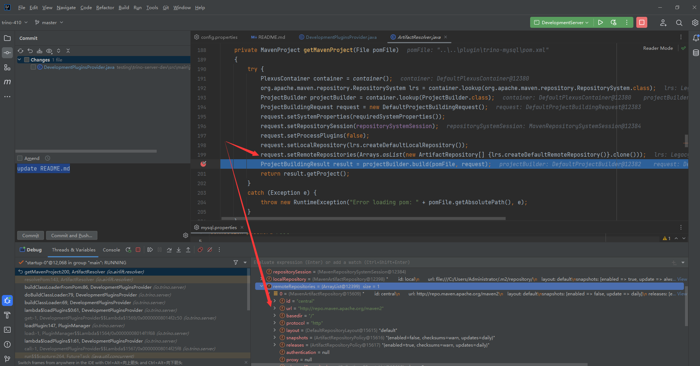
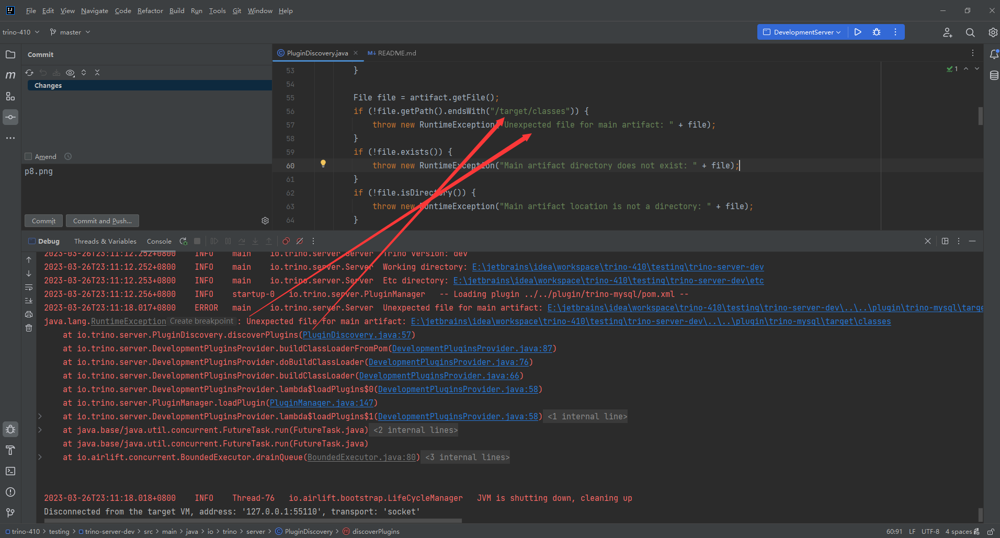

windows下trino的编译，基于 trino 官方源代码 410 tag

#### 源码编译

> 修改根 pom.xml 的插件： git-commit-id-plugin

~~~xml

<plugin>
    <groupId>pl.project13.maven</groupId>
    <artifactId>git-commit-id-plugin</artifactId>
    <configuration>
        <failOnNoGitDirectory>false</failOnNoGitDirectory>
        <runOnlyOnce>true</runOnlyOnce>
        <injectAllReactorProjects>true</injectAllReactorProjects>
        <offline>true</offline>
        <useNativeGit>true</useNativeGit>
    </configuration>
</plugin>
~~~

> 注释根 pom.xml 中的不必要模块

- trino-server-rpm
- docs
- plugin/trino-kafka

> 跳过代码格式检查，在跟pom.xml中的 properties 标签添加如下内容

~~~properties
 <air.check.skip-extended>true</air.check.skip-extended>
~~~

> 注释或移除项目中所有的 really-executable-jar-maven-plugin maven插件

> 跳过项目中所有的代码检查插件 maven-enforcer-plugin

~~~xml

<plugin>
    <groupId>org.apache.maven.plugins</groupId>
    <artifactId>maven-enforcer-plugin</artifactId>
    <configuration>
        <skip>true</skip>
    </configuration>
</plugin>
~~~

> trino-server-dev 配置maven插件

~~~xml

<build>
    <plugins>
        <plugin>
            <groupId>org.apache.maven.plugins</groupId>
            <artifactId>maven-dependency-plugin</artifactId>
            <configuration>
                <skip>true</skip>
            </configuration>
        </plugin>
    </plugins>
</build>
~~~

修改完上面的配置后 执行命令 mvn clean install -DskipTests=true,经过十多分钟的变异后,基本能成功

### 启动前准备

项目的配置文件都在 testing/trino-server-dev/etc 目录下，在启动服务前，我们不先启动全部的插件，先选择不启动任何插件，将

- catalog
- config.properties
- exchange-manager.properties

三个文件或文件夹进行备份或删除，其中 exchange-manager.properties 这个源文件一定要改名或者删除掉，这个坑我直接踩了一个下午

最后将 config.properties 中的 plugin.bundles 全部注释掉，裸机启动

### 启动服务

> 加载 antlr4

~~~shell
mvn antlr4:antlr4
~~~

> 配置启动环境

Trino comes with sample configuration that should work out-of-the-box for
development. Use the following options to create a run configuration:

* Main Class: `io.trino.server.DevelopmentServer`
* VM Option: `-ea -Dconfig=etc/config.properties -Dlog.levels-file=etc/log.properties -Djdk.attach.allowAttachSelf=true`
* Working directory: `$MODULE_DIR$`
* Use classpath of module: `trino-server-dev`

The working directory should be the `trino-server-dev` subdirectory. In
IntelliJ, using `$MODULE_DIR$` accomplishes this automatically.

If `VM options` doesn't exist in the dialog, you need to select `Modify options`
and enable `Add VM options`.

> 修改方法: io.trino.server.TrinoSystemRequirements.verifyOsArchitecture

~~~java
//将这一句注释掉或者将 failRequirement 改为 warnRequirement
failRequirement("Trino requires Linux or Mac OS X (found %s)",osName);
~~~

> 修改方法： io.trino.server.TrinoSystemRequirements.verifyFileDescriptor，

~~~java
 OptionalLong maxFileDescriptorCount=getMaxFileDescriptorCount();
        OptionalLong maxFileDescriptorCount=OptionalLong.of(100000);
~~~

至此，启动就完成

~~~text
2023-03-26T22:31:58.614+0800	INFO	main	io.trino.security.AccessControlManager	-- Loading system access control etc\access-control.properties --
2023-03-26T22:31:58.617+0800	INFO	main	io.trino.security.AccessControlManager	-- Loaded system access control default --
2023-03-26T22:31:58.655+0800	INFO	main	io.trino.server.Server	======== SERVER STARTED ========
~~~

访问页面  http://localhost:8080/ui  也能看到相应的页面

### 插件启动

这里我们以 mysql 的插件为例，因为我本地只装了 mysql ..doge.. ,其余的插件跟 mysql 没啥差别,配置如下

不出意外的话，你肯定跑不起来，控制台会报错如下

~~~text
[FATAL] Non-resolvable parent POM for io.trino:trino-root:410: Could not transfer artifact io.airlift:airbase:pom:133 from/to central (http://repo.maven.apache.org/maven2): Failed to transfer http://repo.maven.apache.org/maven2/io/airlift/airbase/133/airbase-133.pom. Error code 501, HTTPS Required and 'parent.relativePath' points at wrong local POM @ io.trino:trino-root:410, E:\jetbrains\idea\workspace\trino-410\pom.xml, line 6, column 13
 for project io.trino:trino-mysql:410 at E:\jetbrains\idea\workspace\trino-410\testing\trino-server-dev\..\..\plugin\trino-mysql\pom.xml
~~~

这是因为请求中央仓库时，必须使用 https 而程序却用了 http

点击报错的地方，可以看到这么一段源代码: io.trino.server.DevelopmentPluginsProvider.buildClassLoaderFromPom

~~~java
    private PluginClassLoader buildClassLoaderFromPom(File pomFile,Function<List<URL>,PluginClassLoader>classLoaderFactory)
        throws IOException{
        //这里就是解析 mysql 插件的pom.xml的地方，由于这个 resolver 对象时引入的jar，且核心属性都是final修饰，没法继承
        //所以我们只能重写一个 resolver 来代替
        List<Artifact> artifacts=resolver.resolvePom(pomFile);
        PluginClassLoader classLoader=createClassLoader(artifacts,classLoaderFactory);

        Artifact artifact=artifacts.get(0);
        Set<String> plugins=discoverPlugins(artifact,classLoader);
        if(!plugins.isEmpty()){
        File root=new File(artifact.getFile().getParentFile().getCanonicalFile(),"plugin-discovery");
        writePluginServices(plugins,root);
        classLoader=classLoader.withUrl(root.toURI().toURL());
        }

        return classLoader;
        }
~~~

诚如上面的注释所说，我们只需要 复制 一个jar包中的resolver ，然后重写需要的方法，我们就能把 http 改成
https,代码参考 **io.trino.server.HttpsArtifactResolver** 这个类即可

注意：因为偷懒，**io.trino.server.HttpsArtifactResolver** 的本地仓库固定写了，结合自己的环境修改，这个很重要
，不然后面通过 ClassReader 获取类会找不到(ClassNotFound)

~~~java
public static final String USER_LOCAL_REPO="E:\\maven\\rep";
~~~

然后将下面两个类的相应resolver变更即可

- io.trino.server.DevelopmentPluginsProvider
- io.trino.server.DevelopmentLoaderConfig

重新启动，我们将 http 改成了 https,而且使用的是 阿里云 仓库地址，取代了 源码中 的 中央仓库地址，发现刚才的错误消失了，但是新的错误产生了

这是因为 linux 与 windows 路径书写方式不一样造成的,而 trino 的代码原本的需求就是必须使用 linux 或 mac ，所以我们需要修改代码兼顾下
> 修改 io.trino.server.PluginDiscovery.discoverPlugins()  兼顾windows

~~~java
    if(!(file.getPath().endsWith("/target/classes")||file.getPath().endsWith("\\target\\classes"))){
        throw new RuntimeException("Unexpected file for main artifact: "+file);
        }
~~~

> 修改 io.trino.server.PluginDiscovery.binaryName(),适配windows

~~~java
private static String binaryName(String javaName){
        String property=System.getProperty("os.name");
        if(property.trim().toLowerCase().contains("windows")){
        return javaName.replace('.','\\');
        }
        return javaName.replace('.','/');
        }
~~~

> 修改 io.trino.server.PluginDiscovery.javaName

~~~java
    private static String javaName(String binaryName){
        return binaryName.replace('/','.').replace("\\",".");
        }
~~~

不出意外，你遇到了启动过程中的最后一个错误，废话不多说，自动上代码
> 修改 io.trino.server.PluginDiscovery.readClass(),适配非插件类的target

~~~java
    private static ClassReader readClass(String name,ClassLoader classLoader){
        try(InputStream in=classLoader.getResourceAsStream(binaryName(name)+CLASS_FILE_SUFFIX)){
        if(in==null){
        // throw new RuntimeException("Failed to read class: " + name);
        return new ClassReader(name);
        }
        return new ClassReader(toByteArray(in));
        }catch(IOException e){
        throw new UncheckedIOException(e);
        }
        }
~~~

至此,整个 mysql 插件就加载完成，项目也就启动成功了.

### 自定义连接器

- trino-taosdb ： 基于jdbc协议实现的 tdengine 连接器
- trino-tdengine ： 源码级别实现的 tdengine 连接器
- trino-kingbase ： 基于jdbc协议实现的 人大金仓 连接器
